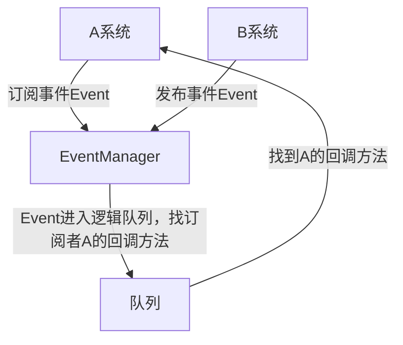

# 事件系统设计文档

## 设计理念

在模块化、高可扩展的游戏架构设计中，**模块间通信机制是决定框架健壮性、可维护性与迭代效率的核心命脉。**传统游戏开发中采用的直接类引用、方法硬调用、单例全局访问等通信方式，会直接导致模块间深度耦合、业务逻辑交叉嵌套、代码修改牵一发而动全身，既无法实现单个模块的独立测试与热更新，也难以支撑复杂游戏逻辑的长期迭代，同时在多线程、分时序执行的游戏场景中，极易引发执行时序混乱、生命周期冲突、内存泄漏与逻辑异常。

为从根源上解决上述行业痛点，本框架设计并实现了一套完整的全局事件系统，作为**所有核心模块的唯一标准化通信中介。**事件系统的核心设计目标，是彻底实现游戏内各功能模块的**零耦合解耦——**所有子系统仅需关注自身业务逻辑的实现与事件的发布、订阅行为，无需感知通信对象的具体类型、实例状态与实现细节，完全剥离模块间的直接依赖关系，让每个系统均可独立开发、独立测试、独立启用与禁用，大幅降低业务扩展与代码维护的成本。

同时，针对游戏执行的时序特性与性能需求，本事件系统采用**逻辑、渲染、物理、音频多队列分层调度**设计，通过独立协程与精细化帧率控制，分离不同优先级、不同执行阶段的事件任务，规范全局消息的执行时序，避免跨模块调用导致的帧耗时波动与逻辑阻塞，保障游戏运行的稳定性与流畅度。

此外，本事件系统通过**强类型约束、柔性数据容器、双层路由管控、静态常量规约**等迭代优化设计，在实现解耦的同时，彻底解决传统弱类型事件存在的类型不安全、传参协议混乱、魔法字符串泛滥、事件链路不可控、运行时无法动态开关等问题，让模块通信既具备极致的灵活性，又拥有工程化开发所需的规范性、安全性与可追溯性，为整个框架的配置化驱动、可视化编辑、全流程自动化打下最核心的底层通信基础。

## 模块总览

*Unity内架构目录 ： Assets/Scripts/Core/Event*

### EventManger(核心管理者)

#### 事件总控

主要功能：

1. 设计事件队列，分别是逻辑，渲染，物理，音频四大队列，协程控制，帧率区分
2. 设计监听与发布逻辑，通过事件队列传输，达成模块间通信职责
3. 单例，初始化被全局总控调用创建，切换场景不被销毁
4. 规定事件传输类型及事件携带值

事件订阅发布流程图



#### 事件打包器

主要功能：

1. 便捷存方法值，规范打包成统一包类
2. 通过包类继承事件基类规范事件传输值
3. 万能柔性容器，通过静态字符串身份ID确定包内不同值，可存多类型，多同类型

打包流程

```c#
//定义打包容器
 var Pack = new Package();
//存储值，，ID为值的静态字符串身份ID，xxx可以为任意类型值
 Pack.Put(ID, xxx);
//定义事件类,把打包值存进去
 var pub = new 事件ID {package = Pack};
//调用发布
xxx系统.发布模块.对应发布方法名(pub);
```

### EventRoute(事件路由)

#### 事件基类

主要功能：

1. 定义所有系统模块的发布/接收方父级，统一规范
2. 自动注册ID配合事件路由配置便捷控制事件链路
3. 整合销毁方法，动态注销事件
4. 发布方设置全局缓存通用检测方法，新添加事件不用多写沉余代码

核心功能：

注册ID

```c#
//配合路由配置自动注册系统ID
public abstract string SystemID {  get; }
```

注销

```c#
//Manager调用方法注销
接收端.UnlistenAllEvent();
发布端.UnlistenAllEvent();
```

#### 事件反射工具

主要功能：

1. 包装事件系统方法
2. 反射配合配置化路由加载事件链

#### 事件路由表缓存

通用格式：

```c#
public class EventRouteCacheUnit
{
    //自定义SystemID
    public string systemID;
    //系统实例
    public object systemInstance;
    //事件类型
    public Type eventType;
    //绑定的委托回调
    public Delegate handlerDelegate;
    //队列类型
    public EventQueueType queueType;
    //是否启用
    public bool isEnable;
    //对应事件处理方法
    public MethodInfo publishMethod;
}
```

#### 事件注册

主要功能：

1. 负责加载事件路由配置，选择是否加载指定事件
2. 设定全局缓存，用来动态管理事件
3. 发布端和接收端统一走事件注册逻辑
4. 设定注销方法，基类封装调用

### 事件资料

#### 事件打包值类

主要功能：

确定事件值身份ID的静态字符串类，与事件打包器联动

#### 事件基础库

结构：

```c#
//基类
public abstract class EventBase
{

}
//包事件基类
public abstract class PackageEvent : EventBase
{
    public Package package;
}
```

新添事件只需要

```c#
//继承打包类
public class GameInit : PackageEvent { }
```


## 接口规范

新建系统事件流程

1.先定义发布方和接收方

```c#
//例如：定义工厂系统订阅方子模块
public class FactoryLogic : BaseBusinessSystem
{
    public override string SystemID => "FactoryLogic";
}
```

2.写具体回调方法

```c#
//直接写空壳事件
public class FactoryLogic_OnResponseChessConfig_InitChessConfig  : PackageEvent { }
```

3.写具体回调方法

```c#
//例：工厂创建方法，统一回调值为PackageEvent e
private void OnResponseChessConfig(PackageEvent e)
{//里面写具体解析方法}
```

4.定义配置

```json
//例：定义五个属性，系统ID，事件名，回调方法，事件队列，是否启用
"FactoryLogic_OnResponseChessConfig_InitChessConfig": {
    "SystemID": "FactoryLogic",
    "EventTypeFullName": "FactoryLogic_OnResponseChessConfig_InitChessConfig",
    "HandlerMethodName": "OnResponseChessConfig",
    "QueueType": "Logic",
    "IsEnable": "true"
  }
```

5.实例化子模块

```c#
//定义
public FactoryLogic _logic;
public FactoryPublish _publish;
//初始化
private void Awake()
{
    _logic = new FactoryLogic();
	_publish = new FactoryPublish();
}
```

6.子模块调用

```c#
//例：配置系统发布事件
var pub = new FactoryLogic_OnResponseChessConfig_InitChessConfig { package = Pack };
ConfigManager.Instance._publish.FactoryLogic_OnResponseChessConfig_InitChessConfig(pub1);
```


## 未来拓展

当前版本事件系统已完成**模块完全解耦、分层队列调度、强类型安全传参、双层路由配置管控**的核心架构建设，实现了事件运行时开关、配置表路由、模块无依赖通信等基础工程化能力，整体事件执行链路具备稳定、规范、可管控的底层能力。

但现阶段框架仍处于**架构层解耦完成、工具层尚未完善**的过渡阶段。在新增事件、调整事件链路、修改事件通信逻辑的开发流程中，仍需进入指定模块编写对应事件壳、声明事件路由、配置对应解析逻辑，依然存在少量代码侵入，无法做到完全脱离代码编辑。当前事件链路的修改、新增、调整高度依赖开发手动编码实现，缺少可视化、标准化、自动化的工作流支撑。

因此，后续版本将重点**补齐事件系统的工具链与可视化编排能力，**向「零代码/低代码事件工作流」方向迭代，核心拓展目标如下：

1. **实现可视化事件节点编辑工具**
  开发自定义编辑器UI窗口，支持以**拖拽节点**的形式快速创建、删除、关联事件通信链路，无需手动新建事件类与路由配置，直观展示事件发布者、接收者、执行队列、执行顺序、开关状态，让事件链路可视化、可预览、可快速调试。

2. **支持事件流程动态编排与外部配置化修改**
未来将彻底脱离代码层级修改逻辑，允许在编辑器内直接调整事件链结构、修改事件触发关系、增删模块通信节点，所有逻辑变更均通过外部工具完成，无需改动底层架构与业务代码，实现**逻辑可热改、流程可重组。**

3. **实现事件配置自动生成与反序列化落地**
工具编辑完成的事件节点与链路数据，将自动序列化生成标准化配置文件，框架运行时通过反序列化自动注册事件、生成路由表、绑定通信关系，实现**事件创建、注册、路由、启用的全自动化，**彻底消除人工配置与编码冗余。

4. **建立完整标准化事件开发工作流**
通过工具链升级，最终形成「可视化编辑→自动生成配置→框架自动注册→运行时动态生效」的标准化闭环工作流。让事件系统从当前**架构解耦规范**升级为**接口统一、流程标准、工具赋能、可工业化迭代**的完整通信体系，进一步降低项目迭代成本，提升框架可拓展性与工程化上限。

## 版本更新日志

| 版本号 | 日期       | 迭代内容                             |
| ------ | ---------- | ------------------------------------ |
| v0.1.0 | 2026-05-16 | 完成事件架构解耦初版，编写第一篇文档 |
